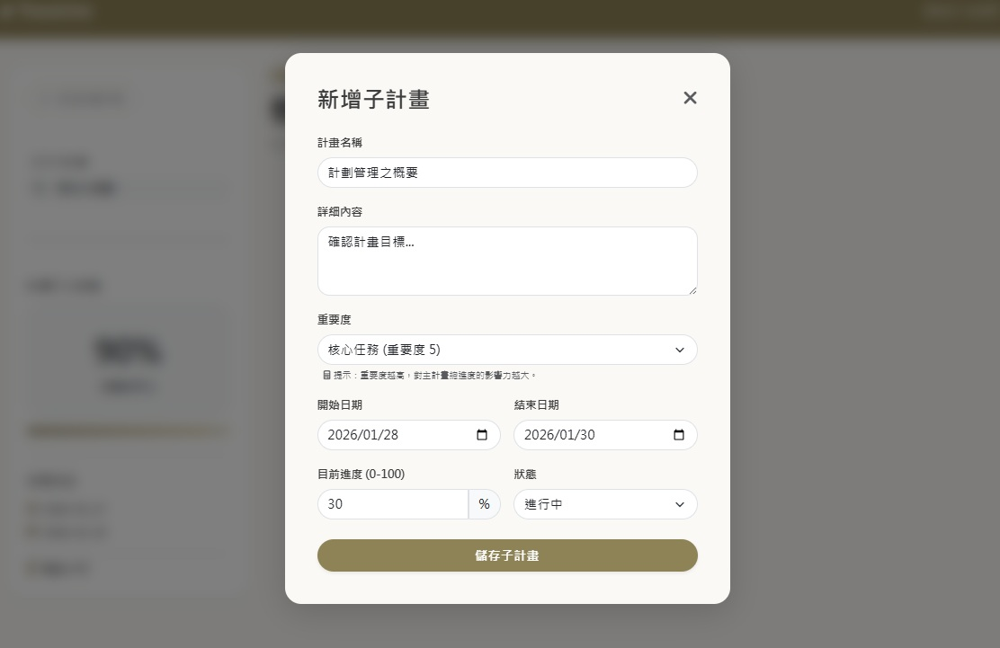

# TraceLine 進度追蹤與計畫管理系統
基於 ASP.NET Core 與 React 的進度管理系統


## 專案簡介與開發動機
TraceLine 是一款基於前後端分離概念開發的 SPA 單頁式計畫管理平台。

開發動機源於對現代碎片化任務管理的思考：　
許多工具僅停留在代辦清單層面，缺乏「目標脈絡」。本專案透過 「主子計畫」的層級架構，協助使用者從主要目標（主計畫）深入到各個階段的步驟（子計畫），並透過自動化的進度加權計算，掌握整體進度。


## 技術

- 後端開發： ASP.NET Core Web API (C#)

- 前端開發： React.js、Bootstrap 5、SweetAlert2

- 資料庫： MS SQL Server

- ORM / 資料庫存取： Entity Framework Core、 Dapper

- 身份驗證： JWT 認證機制

- 架構設計： 三層式架構、RESTful API Design

---

## 核心功能

- 多層級計畫管理： 支援主計畫與無限擴充的子計畫關聯，清晰呈現進度脈絡。

- 進度連動邏輯： 子計畫狀態改變時，後端自動重新加權計算主計畫之進度狀態，確保數據準確。

- 搜尋與篩選功能： 整合關鍵字搜尋與計畫狀態過濾。

- 視覺化進度追蹤： 包含自動化日期倒數、進度條樣式設計。

- 會員系統： 實作會員註冊、登入登出機制，確保使用者資料的獨立性與安全性。

---

## 專案角色與技術貢獻

獨立負責全端開發，涵蓋從資料庫設計到 UI/UX 實作：

- 架構設計： 採用三層式架構使程式碼層次分明，並以前後端分離提升靈活度。

- 資料同步處理： 解決了 React 組件間的狀態同步難題。

- API 效能優化： 在特定情境使用 Dapper 增加效能運用，提升查詢效率。

---

## 技術挑戰與解決方案

### 父子組件間的數據同步問題

問題： 在子頁面更新數據後，主頁面列表無法即時反應最新進度。

解決： 將數據獲取邏輯整合於父組件，並透過 Callback 函數達成跨組件的整合機制。


### 資訊負載與 UI 平衡

問題： 列表卡片需展示多項資訊（日期、進度、內容），易造成視覺擁擠。

解決： 淡化次要資訊並強化核心進度數字，達成兼具資訊量與美感的平衡。

---

## 介面展示

### 會員登入

*支援 JWT 身份驗證機制。*

### 主計畫列表

*展示計畫進度、剩餘天數，並支援關鍵字搜尋。*

### 子計畫管理

*條列式管理子計畫，並連動主計畫總進度。*

### 新增子計畫表單

*支援日期區間選取與驗證。*

---


# 技術架構
```mermaid
graph TD
    User((使用者)) -->|操作 UI| React[React.js 前端介面]
    React -->|JWT 驗證請求| API{ASP.NET Core API}
    API -->|查詢/更新| DB[(MS SQL Server)]
    
    subgraph "Backend Logic"
    API --- Service[加權進度計算邏輯]
    API --- Repo[Repository 資料存取層]
    end
    
    subgraph "Data Access"
    Repo --- EF[EF Core: 維護/關聯]
    Repo --- Dapper[Dapper: 高效查詢]
    end


